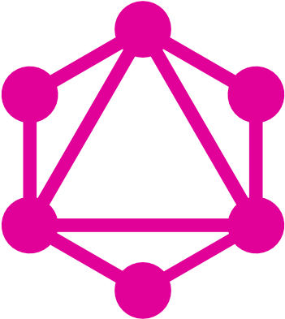

<h1 align="center">
  Welcome to TimaFilli's profile!
  
</h1>

<h1 align="center">
  I`m Junior Node.JS Developer
   
  
</h1>

 

  <a href="https://github.com/timafilli">
  
  

 
  
## 🤹 Languages and Tools:

  

  <!-- 
   -->

  

  

  

  

  

  

  

  

  
  
  

  

 
  

  

   

  <!--  -->
 
  
  <a href = "mailto:timafilli15@gmail.com">
   
      
  <!--  -->

   

